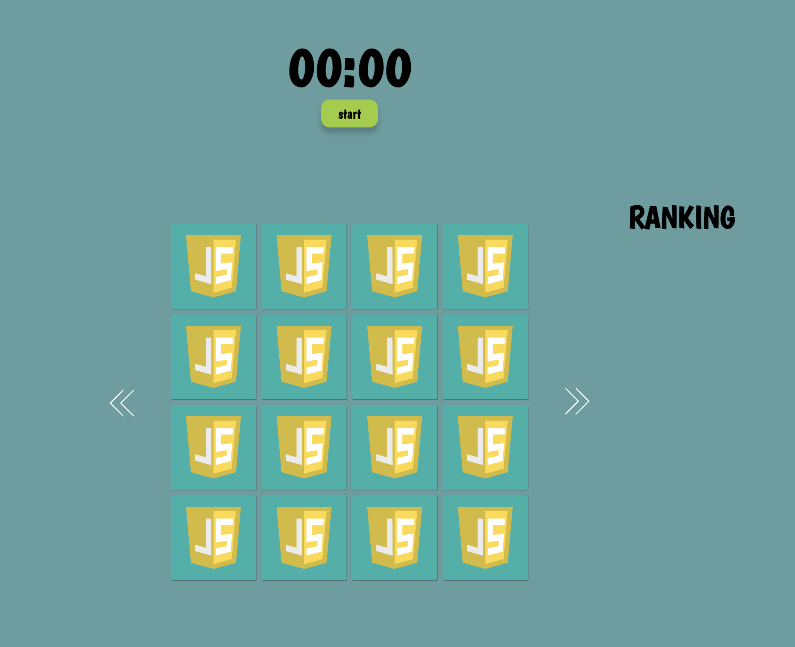
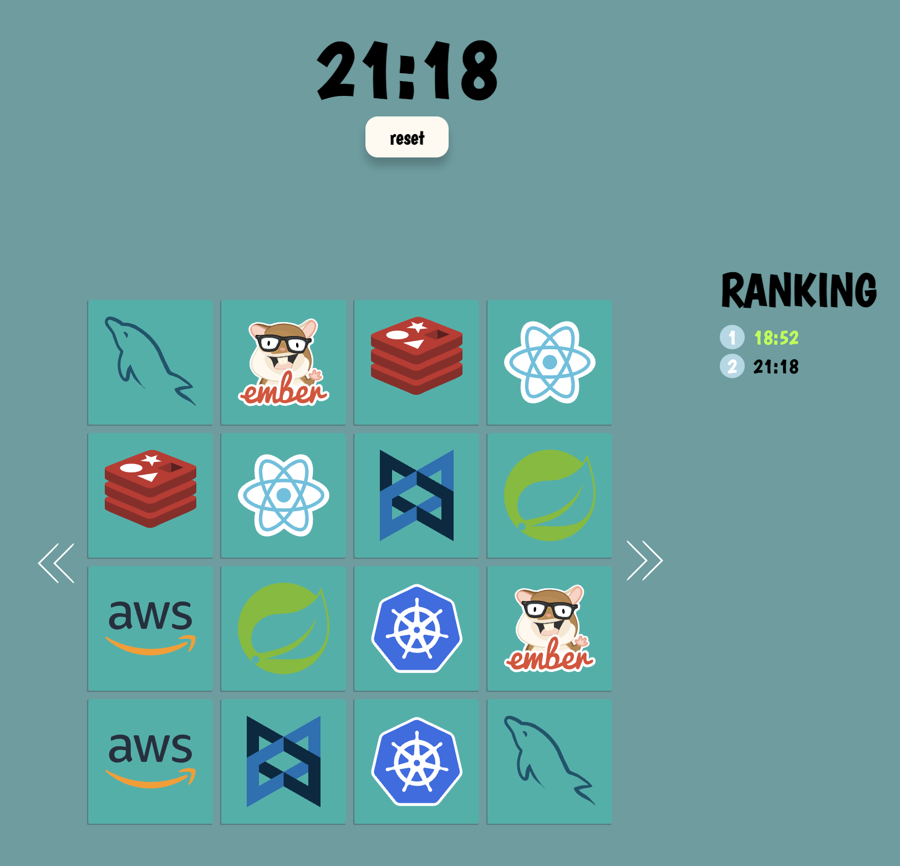
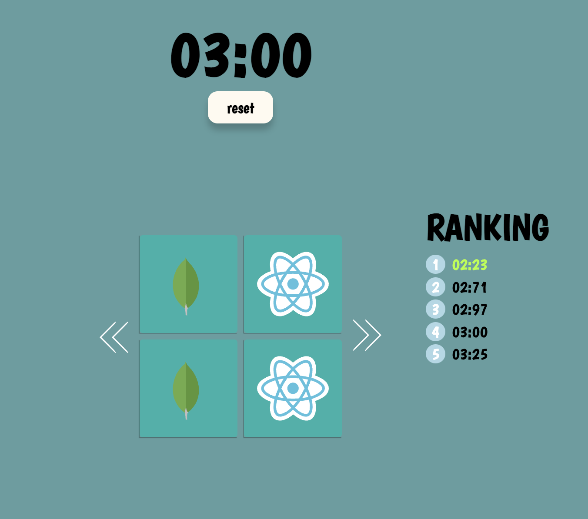
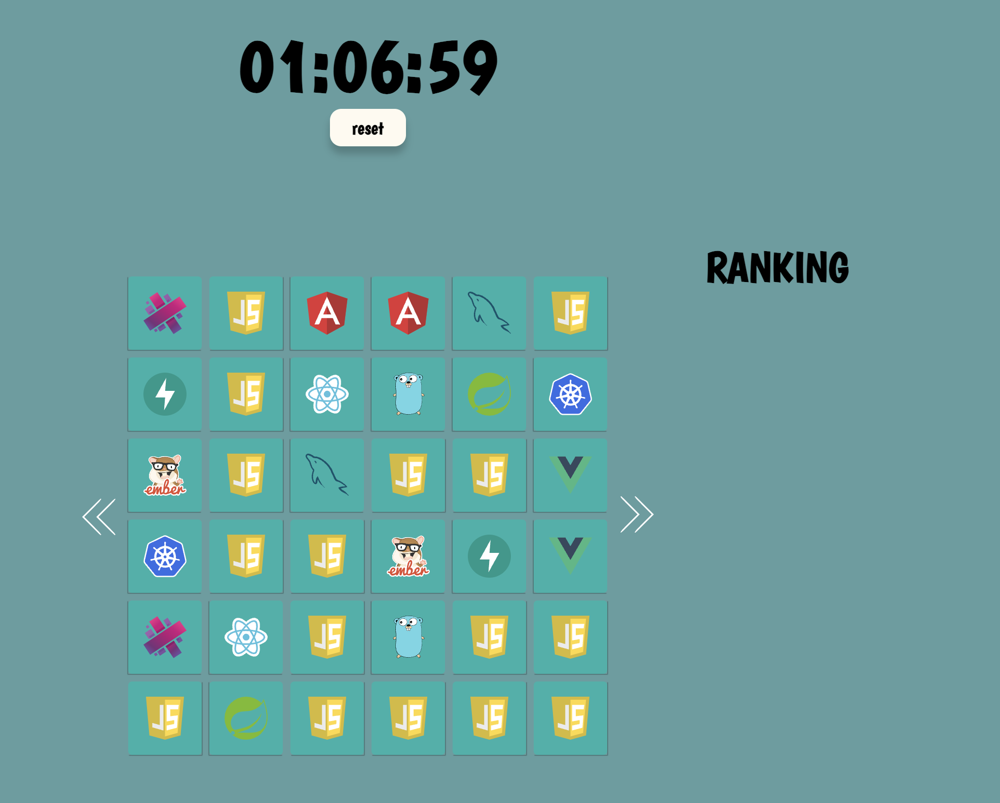

# Memory Game

cloning [this Memory Game](https://marina-ferreira.github.io/projects/js/memory-game/).  
Publish on Github page

## 추가 사항

### 1. 스탑워치 추가
- 게임 시작 후 종료될 때 까지 걸린 시간 측정
- 이를 바탕으로 순위 선정
- 레벨 1과 2는 초단위까지 나오고 레벨3은 분 단위 까지 나옴
- start 누르면 reset 버튼으로 바뀜 (vice versa)

### 2. 랭킹
- 게임 완료 시 까지 걸린 시간 기록
- 상위 5개 기록 노출
- 각 레벨 별 순위 표시

### 3. 난이도 조절
- 게임 보드 양 옆 화살표를 통해 난이도 조절 가능
- 2x2, 4x4, 6x6 게임 있음
- 이미지만 많이 넣는다면 계속 늘릴 수 있음
- 2*2 게임의 경우 카드 크기 조절을 위해 전체 보드 크기를 줄임

---
### vue 사용하여 동일하게 구현하기